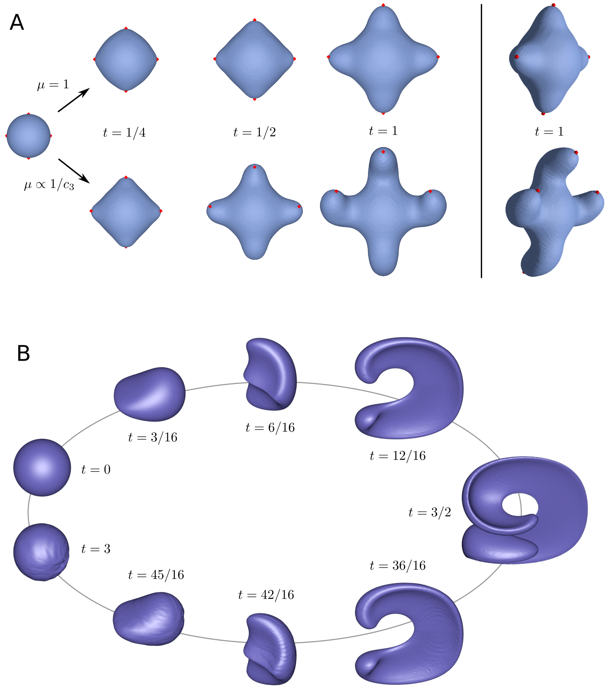

# fluidtissue

_fluidtissue_ is a cell-free continuum model of generalized tissue growth. The tissue is assumed to behave as viscous fluid so that its behavior can be described with the Stokes equation with variable viscosity and mass sources. The growth is directed by a diffusing growth factor produced by signaling centers, whose positions are established through a reaction-diffusion system acting in the tissue interior. The model is solved using the finite element method on a tetrahedral mesh, with the level set method for interface tracking.

Detailed description of the model is presented in [[1]](#references). The C++ implementation is available under the MIT license.

  
  <figcaption> 
  Figure: (<b>A</b>) The effect of variable viscosity on the growth (top row: constant viscosity, bottom row: viscosity inversely proportional to the growth factor). The red dots on the tissue surface indicate the signaling centers that produce the growth factor. (<b>B</b>) Numerical validation: Enright's test for interface reconstruction under extreme interface deformation (domain resolution 256^3 nodes).
  </figcaption>

## Usage

### Requirements:
 
- Compiler: Clang >= 6.0
- CUDA libraries: Version not strict, as long as it is compatible with the compiler.
- Eigen >= 3.3.x 
- CGAL. Optionally TBB if using multithreaded Delaunay for mesh generation.
- A CUDA GPU, a modern CPU and 32GB RAM (for high resolution simulations).
- Linux (Ubuntu >= 18.04), macOS (>= 10.12). 

### Building

Compile by calling `make`. Two binaries are produced, `./bin/growth` for the Stokes simulations and `./bin/leveque` for the Enright's test.
For macOS the library dependencies are assumed to be installed via MacPorts in the default location (/opt/local/).

### Running

To reproduce the simulations presented in [[1]](#references), first copy the binaries `./bin/*` into `./parameters/`. Enter, e.g., `./parameters/Fig3A/` and call `sh run_fig3a.sh` to run the simulation of Figure 3A in the manuscript. 

Run times of individual simulations vary from minutes to several hours, depending on the resolution, viscosity parameters and solver accuracy (stabilized P1-P1 vs. P2-P1 for Stokes).

The binaries write geometry output in Wavefront OBJ format, with the computational domain outer boundary encasing the actual object surface. Use `./utils/ParseOBJ/parseobj` to extract the object surface only (requires [tinyobjloader](https://github.com/syoyo/tinyobjloader) to compile).

## What is it good for?

That's for the future.

## References
[1] Häkkinen TJ, Jernvall J, Hannukainen A. Modeling tissue growth with the Stokes equation. bioRxiv. 1:641282, May 2019.
